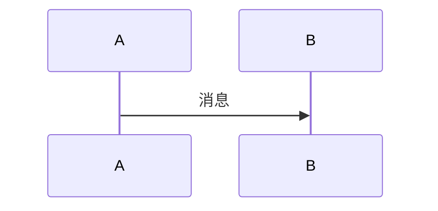

# Slidev PPT Generator

🦞 **OpenClaw Skill** | 📝 **Markdown 写 PPT** | 🚀 **一键生成专业幻灯片**

[](https://opensource.org/licenses/MIT)
[](https://clawhub.ai)

---

## ✨ 特性

- 🎯 **AI 驱动** - OpenClaw 自动生成内容
- 📝 **Markdown 编写** - 写文档一样做 PPT
- 🎨 **多主题支持** - 内置 + 社区主题
- 📤 **多格式导出** - HTML / PDF / PPTX
- 🔧 **高度可定制** - Vue 组件 + 自定义样式
- 🆓 **完全免费** - 开源 MIT 协议

---

## 🚀 快速开始

### 1️⃣ 安装 Skill

```bash
# 通过 ClawHub 安装
npx clawhub@latest install slidev-ppt-generator

# 或手动安装
git clone https://github.com/laofahai/slidev-ppt-generator.git ~/.openclaw/skills/slidev-ppt-generator
openclaw gateway restart
```

### 2️⃣ 初始化 Slidev 环境

```bash
# 创建项目
npm init slidev@latest ~/slidev-ppt

# 进入项目
cd ~/slidev-ppt

# 安装依赖
npm install

# 安装 Playwright（导出 PDF/PPTX 需要）
npm i -D playwright-chromium
```

### 3️⃣ 使用

在 OpenClaw 中直接说：

```
帮我做一个关于 OpenClaw 介绍的 PPT
```

AI 会自动：
1. 检查 Slidev 环境
2. 生成 slides.md 内容
3. 启动预览服务器
4. 询问是否需要导出

### 4️⃣ 导出

```bash
cd ~/slidev-ppt

# 导出 PDF
slidev export --format pdf --output presentation.pdf

# 导出 PPTX
slidev export --format pptx --output presentation.pptx

# 构建 HTML
slidev build --out dist/
```

---

## 🎯 使用场景

| 场景 | 推荐模板 | 推荐主题 |
|------|----------|----------|
| 技术分享 | tech-share | default / seriph |
| 产品演示 | product-demo | hubro / eloc |
| 工作汇报 | report | apple-basic |
| 教学培训 | teaching | default |
| 会议演讲 | conference | seriph |

---

## 🛠️ 脚本工具

项目包含两个实用脚本：

### generate.js - 内容生成

```bash
node scripts/generate.js --topic "你的主题" --output slides.md
```

**选项：**
- `-t, --topic` - PPT 主题（必需）
- `-o, --output` - 输出文件路径
- `-p, --pages` - 期望页数
- `-s, --style` - 风格：tech|product|report
- `-a, --author` - 作者姓名

### export.js - 导出封装

```bash
node scripts/export.js --format pdf --output presentation.pdf
```

**选项：**
- `-f, --format` - 导出格式：pdf|pptx|png|md
- `-o, --output` - 输出文件路径
- `--with-clicks` - 包含动画步骤
- `--range` - 导出指定页

---

## 🎨 主题系统

### 内置主题

- `default` - 默认主题，适合技术分享
- `seriph` - 优雅衬线字体，适合正式场合

### 社区主题

```bash
# 极简风
npm i slidev-theme-apple-basic

# 优雅风格
npm i slidev-theme-eloc

# 商务风格
npm i slidev-theme-hubro

# 可爱风格
npm i slidev-theme-cosmo
```

### 自定义主题

在 `slides.md` 中配置：

```markdown
---
theme: default
colorSchema: dark
highlighter: shiki
background: /path/to/bg.png
fonts:
  sans: 'Inter'
  mono: 'Fira Code'
---
```

---

## 📝 Markdown 语法

### 分页

```markdown
---

# 第一页

---

# 第二页
```

### 布局

```markdown
---
layout: two-cols
---

# 左侧

内容

::right::

# 右侧

内容
```

### 代码高亮

````markdown
```typescript {1|3|5-7}
function add(a: number, b: number) {
  return a + b
}
```
````

### 数学公式

```markdown
$$
x = \frac{-b \pm \sqrt{b^2-4ac}}{2a}
$$
```

### Mermaid 图表

```markdown

```

---

## 🤝 贡献

欢迎提交 Issue 和 PR！

### 开发环境

```bash
# 克隆项目
git clone https://github.com/laofahai/slidev-ppt-generator.git

# 进入目录
cd slidev-ppt-generator

# 安装依赖
npm install

# 测试脚本
node scripts/generate.js --topic "测试" --output test.md
```

### 提交规范

- `feat:` 新功能
- `fix:` 修复 bug
- `docs:` 文档更新
- `style:` 代码格式
- `refactor:` 重构
- `test:` 测试
- `chore:` 构建/工具

---

## 📄 许可证

MIT License

---

## 👤 作者

**闫志鹏 (laofahai)**

- GitHub: [@laofahai](https://github.com/laofahai)
- 公司：诸城市新起点供应链管理有限责任公司
- 项目：LinchKit / OpenClaw Agent 体系

---

## 🔗 相关链接

- [Slidev 官方文档](https://cn.sli.dev/)
- [Slidev GitHub](https://github.com/slidevjs/slidev)
- [OpenClaw 官网](https://openclaw.ai)
- [ClawHub 技能市场](https://clawhub.ai)
- [主题列表](https://sli.dev/guide/theme-addon-gallery)

---

**Made with ❤️ by laofahai**
