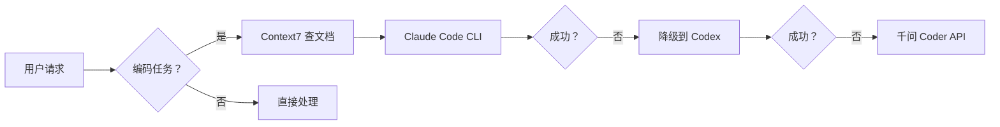

# OpenClaw 自托管 AI Agent 网关

## 技术架构与最佳实践

<div class="mt-8 text-gray-400 text-sm">

自托管 · 多渠道 · Agent 原生 · 本地优先

</div>

---
layout: two-cols
---

## 什么是 OpenClaw？

**自托管网关**：连接聊天应用到 AI Agent 的桥梁

<div class="mt-6 space-y-3 text-sm">

✓ 运行在您自己的机器上

✓ 单一进程服务多个渠道

✓ 数据完全本地化

✓ 直接调用本地/云端模型

</div>

::right::

## 核心价值

<div class="grid grid-cols-2 gap-4 mt-6">

<div class="bg-blue-900/20 p-3 rounded border border-blue-500/30">

**安全可控**

数据不离开本地

</div>

<div class="bg-green-900/20 p-3 rounded border border-green-500/30">

**低延迟**

本地处理 <100ms

</div>

<div class="bg-purple-900/20 p-3 rounded border border-purple-500/30">

**可定制**

Skills 深度扩展

</div>

<div class="bg-cyan-900/20 p-3 rounded border border-cyan-500/30">

**离线可用**

核心功能无需网络

</div>

</div>

---

## 系统架构全景

<div class="grid grid-cols-3 gap-4 mt-8">

<div class="bg-gray-800/50 p-4 rounded">

### 输入层

- WhatsApp
- Telegram
- Discord
- 飞书/钉钉

</div>

<div class="bg-blue-900/30 p-4 rounded border border-blue-500/50">

### Gateway 核心

- 消息路由
- Agent 编排
- 技能调度
- 记忆管理

</div>

<div class="bg-gray-800/50 p-4 rounded">

### 输出层

- 本地模型 (Ollama)
- 云端 API (百炼)
- 文件系统
- 外部工具

</div>

</div>

<div class="mt-6 text-center text-sm text-gray-500">

单一 Gateway 进程 = 消息收发 + Agent 调度 + 技能执行 + 状态管理

</div>

---

## 多 Agent 路由机制

**主入口统一**：所有消息进入 `main` Agent，按意图自动分发

| 子 Agent | 触发条件 | 模型策略 |
|----------|----------|----------|
| `main` | 默认/简单对话 | 百炼 qwen3.5-plus |
| `mem-assistant` | MEM 备考/学习规划 | 百炼 API |
| `governance-assistant` | 公司治理/组织/制度 | 百炼 API |
| `codex-assistant` | 编码任务 | Claude Code → Codex → 千问 Coder |
| `gemini-assistant` | 中长分析 (只读) | Gemini CLI |
| `scout` | 信息收集/事实核实 | 百炼 API |

<div class="mt-6 text-sm text-gray-400">

**Fallback 链**：Claude Code CLI (5h/天) → Codex CLI → qwen3-coder-next → qwen3-coder-plus → glm-5

</div>

---
layout: two-cols
---

## 编码任务工作流

### 强制规则

<div class="text-sm space-y-3 mt-4">

1. **Context7 MCP 强制查询**

   写代码前必须查官方文档

2. **CLI Agent 优先**

   Claude Code / Codex CLI

3. **Gemini 禁用编码**

   只读，不能写文件/执行命令

</div>

::right::

### 执行流程



---

## 技能 (Skills) 体系

**已安装 13 个核心技能**

<div class="grid grid-cols-3 gap-3 mt-6 text-xs">

<div class="bg-gray-800/50 p-2 rounded">

**baidu-web-search**

百度搜索 (强制)

</div>

<div class="bg-gray-800/50 p-2 rounded">

**qmd**

本地向量检索

</div>

<div class="bg-gray-800/50 p-2 rounded">

**openclaw-backup**

自动备份

</div>

<div class="bg-gray-800/50 p-2 rounded">

**agent-browser**

浏览器自动化

</div>

<div class="bg-gray-800/50 p-2 rounded">

**self-improving**

自我反思

</div>

<div class="bg-gray-800/50 p-2 rounded">

**skill-vetter**

安全审查

</div>

<div class="bg-gray-800/50 p-2 rounded">

**summarize**

URL/文件摘要

</div>

<div class="bg-gray-800/50 p-2 rounded">

**humanizer-zh**

去除 AI 痕迹

</div>

<div class="bg-gray-800/50 p-2 rounded">

**github**

GitHub 交互

</div>

<div class="bg-gray-800/50 p-2 rounded">

**free-ride**

免费模型管理

</div>

<div class="bg-gray-800/50 p-2 rounded">

**clawddocs**

文档专家

</div>

<div class="bg-gray-800/50 p-2 rounded">

**skill-9**

全网信息获取

</div>

</div>

---

## 知识检索体系 (qmd)

**索引状态**：656 文件 / 2701 向量 / 25.9 MB

### 技术配置

| 组件 | 选型 | 说明 |
|------|------|------|
| 嵌入模型 | embeddinggemma | Apple M4 GPU Metal (11.8GB) |
| 重排序 | Qwen3-Reranker | 提升检索精度 |
| 索引引擎 | SQLite | BM25 + 向量混合检索 |
| 自动维护 | Cron Job | 每日 03:00 更新 |

### 查询命令

```bash
# BM25 关键词搜索
qmd search "关键词" -c openclaw

# 向量语义搜索
qmd vsearch "语义查询" -c openclaw

# 混合检索 + 重排序
qmd query "混合查询" -c openclaw

# 获取原文
qmd get qmd://openclaw/path/to/file.md
```

---
layout: two-cols
---

## 典型使用场景

### 开发辅助 💻

- AI 编程 (Claude Code/Codex)
- 代码审查/重构
- 文档查询 (Context7)

### 信息获取 📰

- 百度搜索 (强制)
- 事实核查
- 新闻聚合

::right::

### 系统运维 🔧

- 配置备份/恢复
- 模型切换
- 健康检查

### 知识管理 📚

- 文档写作
- 信息整合
- 记忆提取

### 个人助理 📅

- 日程管理
- MEM 学习规划
- 周报自动生成

---

## 本地优先 vs 云服务

| 维度 | 云服务 (Claude.ai/ChatGPT) | OpenClaw 自托管 |
|------|---------------------------|-----------------|
| **数据隐私** | 数据在第三方服务器 | 完全本地存储 |
| **网络依赖** | 必须在线 | 核心功能离线可用 |
| **响应延迟** | 网络往返 + 排队 (2-10s) | 本地处理 (<100ms) |
| **定制能力** | Prompt 级 | Skills/Agent/配置级 |
| **成本模型** | 订阅制 ($20/月+) | 一次部署 + API 按量 |
| **集成能力** | REST API 调用 | 本地文件/命令/数据库直连 |
| **多 Agent** | 单会话 | 7+ Agent 自动路由 |
| **记忆持久化** | 会话级 | 长期记忆 (OpenViking) |

---

## 安全与备份体系

### 密钥管理

<div class="grid grid-cols-2 gap-4 mt-4">

<div class="bg-green-900/20 p-3 rounded border border-green-500/30">

**✅ SecretRef 存储**

- feishu.appSecret
- bailian.apiKey

位置：`~/.openclaw/secrets.json` (权限 600)

</div>

<div class="bg-gray-800/50 p-3 rounded">

**⚠️ 本地占位符**

- ollama.apiKey

位置：`openclaw.json` (本地模型无需密钥)

</div>

</div>

### 自动备份

- **工具**：`openclaw-backup` (6964 次下载)
- **频率**：每日 03:00 (Cron)
- **格式**：tar.gz (排除缓存/日志)
- **轮转**：保留最近 7 个
- **位置**：`~/openclaw-backups/`

---

## 定时任务与心跳

### Cron 任务 (6 个)

| 任务 | Schedule | 说明 |
|------|----------|------|
| qmd 索引更新 | `0 3 * * *` | 每日 03:00 |
| OpenClaw 备份 | `0 3 * * *` | 每日 03:00 |
| MEM Daily Plan | `0 9 * * 1-5` | 工作日 09:00 |
| MEM Check-in | `0 20 * * 1-5` | 工作日 20:00 |
| MEM Weekly Review | `0 10 * * 0` | 周日 10:00 |
| 周报自动生成 | `0 17 * * 5` | 周五 17:00 |

### Heartbeat 检查 (每 30 分钟)

- qmd 索引状态
- 密钥安全 (每周)
- 组织治理文档 (每周)
- 文控归档 (每周)
- MEM 学习进度 (每 3 天)

---

## 快速开始

### 安装与初始化

```bash
# 全局安装
npm i -g openclaw

# 交互式初始化
openclaw onboard

# 启动网关
openclaw gateway start

# 打开控制 UI
openclaw web
```

### 工作区结构

```
~/.openclaw/workspace/
├── AGENTS.md          # 工作区规则
├── SOUL.md            # 助手行为准则
├── USER.md            # 用户画像
├── MEMORY.md          # 长期记忆
├── HEARTBEAT.md       # 周期检查任务
├── memory/            # 每日日志
├── skills/            # 自定义 Skills
└── foundation/        # 基础能力层
```

### 扩展方式

1. 安装 Skills: `clawhub install <skill>`
2. 自定义 Agent: 编辑 `~/.openclaw/agents/`
3. 配置模型：修改 `openclaw.json`

---

# 总结

## OpenClaw 的核心价值

<div class="grid grid-cols-2 gap-6 mt-8">

<div>

### 技术优势

- 自托管，数据完全本地
- 低延迟 (<100ms)
- 离线可用
- 深度定制 (Skills/Agents)

</div>

<div>

### 工程价值

- 多 Agent 自动路由
- 长期记忆持久化
- 定时任务 + 心跳检查
- 完整的备份体系

</div>

</div>

<div class="mt-12 text-center">

### 开始使用

**文档**：docs.openclaw.ai  
**GitHub**：github.com/openclaw/openclaw  
**Skills**：clawhub.com

<div class="mt-6 text-gray-500 text-sm">

🦞 EXFOLIATE! EXFOLIATE!

</div>

</div>
